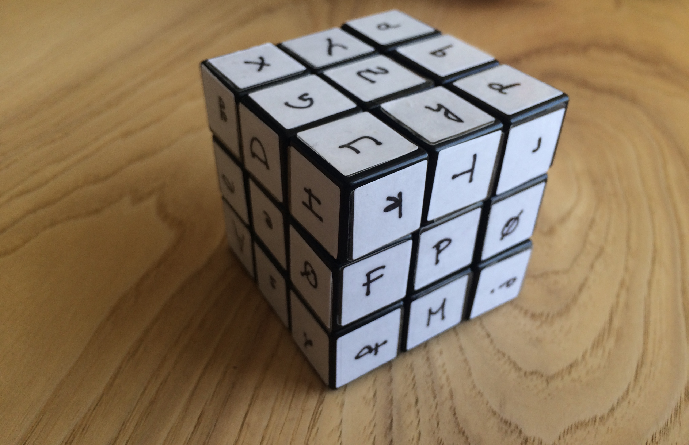

# crypto-rev-cubing
Companion code for a puzzle I made.

This code will tell you if a given side of the **crypto-rev-cube** is correct or not.



# Running
```
go run crypto-rev-cubing.go "testinput"
👽
```
